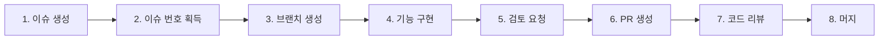

# Eatsfine 백엔드 프로젝트 Claude Code 설정

## 프로젝트 개요

- **프로젝트명**: Eatsfine (식당 예약 시스템)
- **패키지명**: com.eatsfine
- **언어**: Java 21
- **프레임워크**: Spring Boot 3.4.1
- **서비스 URL**: https://www.eatsfine.co.kr
- **API 문서**: https://eatsfine.co.kr/swagger-ui/index.html

---

## 협업 방식 (Issue-Based Workflow)

### 📌 필수 워크플로우

**모든 개발 작업은 반드시 GitHub 이슈를 먼저 생성하고 시작합니다!**



### 1단계: GitHub 이슈 생성
- **템플릿 종류**:
  - `[FEAT]`: 새로운 기능 추가 (`.github/ISSUE_TEMPLATE/feature_request.yml`)
  - `[BUG]`: 버그 수정 (`.github/ISSUE_TEMPLATE/bug_report.yml`)
  - `[REFACTOR]`: 리팩토링 (`.github/ISSUE_TEMPLATE/refactor_template.yml`)

- **필수 작성 항목**:
  - 📄 설명: 작업 내용 상세 기술
  - ✅ 작업할 내용: 체크리스트 형태로 세분화
  - 🙋🏻 참고 자료: 관련 문서나 링크

### 2단계: 브랜치 생성
- **브랜치명 규칙**: `타입/#이슈번호-간단한설명`
- 예시:
  ```bash
  git checkout -b feat/#123-cancel-booking
  git checkout -b fix/#45-payment-error
  git checkout -b refactor/#67-service-cqrs
  ```

### 3단계: 커밋 메시지에 이슈 번호 포함
```bash
git commit -m "feat: 예약 취소 서비스 메서드 구현 #123"
git commit -m "test: 예약 취소 단위 테스트 작성 #123"
```

### 4단계: 검토 요청 (필수)
구현 완료 후 **반드시 사용자에게 검토를 받습니다**.

### 5단계: PR 생성
- PR 템플릿 (`.github/pull_request_template.md`) 사용
- **이슈 번호 연결**: `Closes #123` 또는 `Resolves #123`
- 최소 **2명 승인** 후 머지

### 커뮤니케이션
- **Slack**: Entity 변경, 중요 로직 수정 시 사전 공유
- **GitHub**: 모든 코드 리뷰 및 토론

---

## 기술 스택

### 핵심 프레임워크
- **Framework**: Spring Boot 3.4.1
- **Build**: Gradle
- **Database**: MySQL, Redis
- **ORM**: Spring Data JPA + Hibernate + QueryDSL 5.1.0

### 보안 & 인증
- **Spring Security**: JWT 기반 인증
- **JWT**: JJWT 0.11.5
- **OAuth2**: Google, Naver, Kakao 소셜 로그인

### API & 문서화
- **Springdoc OpenAPI**: 2.8.1 (Swagger UI)
- **Bean Validation**: 요청 DTO 검증

### 클라우드 & 외부 서비스
- **AWS S3**: 이미지 업로드
- **Toss Payments**: 결제 시스템
- **WebFlux**: 비동기 HTTP 통신

### 테스트
- **JUnit 5**: 단위 테스트
- **Mockito**: Mock 객체
- **H2**: 테스트용 In-Memory DB

---

## 개발 명령어

```bash
# 빌드
./gradlew build

# 테스트 실행
./gradlew test

# 특정 테스트만 실행
./gradlew test --tests "com.eatsfine.domain.user.service.UserServiceTest"

# 로컬 실행
./gradlew bootRun

# QueryDSL Q클래스 생성
./gradlew compileJava

# 빌드 파일 정리
./gradlew clean
```

---

## 로컬 환경

- **서버 포트**: `8080`
- **API 문서**: `http://localhost:8080/swagger-ui/index.html`
- **환경변수**: `src/main/resources/application-local.yml` 참고 (Git 제외)

---

## 프로젝트 구조

```
src/
├── main/
│   ├── java/com/eatsfine/
│   │   ├── domain/                      # 도메인 계층 (14개 도메인)
│   │   │   ├── user/                    # 회원 관리
│   │   │   │   ├── entity/              # User.java
│   │   │   │   ├── repository/
│   │   │   │   ├── service/
│   │   │   │   │   ├── auth/           # 인증 관련
│   │   │   │   │   ├── oauth/          # OAuth2 관련
│   │   │   │   │   └── user/           # 사용자 정보
│   │   │   │   ├── controller/
│   │   │   │   ├── dto/
│   │   │   │   ├── converter/
│   │   │   │   ├── enums/               # Role, SocialType
│   │   │   │   ├── exception/
│   │   │   │   └── status/
│   │   │   ├── store/                   # 식당 정보 (핵심 도메인)
│   │   │   │   ├── entity/              # Store.java
│   │   │   │   ├── repository/
│   │   │   │   ├── service/             # Command/Query 분리
│   │   │   │   │   ├── StoreCommandService.java
│   │   │   │   │   └── StoreQueryService.java
│   │   │   │   ├── controller/
│   │   │   │   ├── dto/
│   │   │   │   ├── converter/
│   │   │   │   ├── condition/           # StoreSearchCondition
│   │   │   │   ├── enums/               # Category, DepositRate
│   │   │   │   ├── validator/
│   │   │   │   ├── exception/
│   │   │   │   └── status/
│   │   │   ├── booking/                 # 예약 관리
│   │   │   │   ├── entity/              # Booking, BookingTable, BookingMenu
│   │   │   │   ├── repository/
│   │   │   │   ├── service/
│   │   │   │   ├── controller/
│   │   │   │   ├── dto/
│   │   │   │   ├── converter/
│   │   │   │   ├── enums/               # BookingStatus
│   │   │   │   ├── exception/
│   │   │   │   └── status/
│   │   │   ├── payment/                 # 결제 (Toss Payments)
│   │   │   │   ├── entity/              # Payment.java
│   │   │   │   ├── repository/
│   │   │   │   ├── service/             # PaymentService, TossPaymentService
│   │   │   │   ├── controller/          # 일반 + Webhook
│   │   │   │   ├── dto/
│   │   │   │   ├── enums/               # PaymentStatus, PaymentMethod, PaymentProvider
│   │   │   │   ├── exception/
│   │   │   │   └── status/
│   │   │   ├── menu/                    # 메뉴 관리
│   │   │   ├── businesshours/           # 영업시간
│   │   │   ├── storetable/              # 테이블 관리
│   │   │   ├── tablelayout/             # 테이블 배치도
│   │   │   ├── tableimage/              # 식당 이미지
│   │   │   ├── tableblock/              # 테이블 예약 불가 관리
│   │   │   ├── inquiry/                 # 1:1 문의
│   │   │   ├── region/                  # 지역 정보
│   │   │   ├── term/                    # 약관
│   │   │   ├── businessnumber/          # 사업자번호 검증
│   │   │   └── image/                   # 이미지 공통
│   │   │
│   │   └── global/                      # 전역 설정 계층
│   │       ├── annotation/              # @CurrentUser 등 커스텀 어노테이션
│   │       ├── apiPayload/              # 공통 응답 & 예외
│   │       │   ├── ApiResponse.java     # 통일된 응답 형식
│   │       │   ├── code/                # BaseCode, BaseErrorCode
│   │       │   │   └── status/          # SuccessStatus, ErrorStatus
│   │       │   ├── exception/           # GeneralException
│   │       │   └── handler/             # GeneralExceptionAdvice
│   │       ├── auth/                    # 보안 & 인증
│   │       │   ├── AuthCookieProvider.java
│   │       │   ├── CustomAccessDeniedHandler.java
│   │       │   ├── CustomAuthenticationEntryPoint.java
│   │       │   └── UserDetailsServiceImpl.java
│   │       ├── common/                  # BaseEntity (JPA Auditing)
│   │       ├── config/                  # 설정
│   │       │   ├── SecurityConfig.java  # Spring Security, OAuth2, CORS
│   │       │   ├── SwaggerConfig.java   # Springdoc OpenAPI
│   │       │   ├── JpaAuditConfig.java
│   │       │   ├── QueryDslConfig.java
│   │       │   ├── S3Config.java
│   │       │   ├── TossPaymentConfig.java
│   │       │   └── jwt/                 # JWT 설정
│   │       │       ├── JwtTokenProvider.java
│   │       │       └── JwtAuthenticationFilter.java
│   │       ├── controller/              # HealthController
│   │       ├── s3/                      # S3Service
│   │       └── validator/               # 커스텀 검증
│   │
│   └── resources/
│       ├── application.yml
│       ├── application-local.yml        # 로컬 전용 (Git 제외)
│       ├── application-prod.yml         # 프로덕션 (민감정보)
│       └── application-test.yml         # 테스트
│
└── test/
    └── java/com/eatsfine/
        ├── EatsfineApplicationTests.java
        ├── controller/
        │   └── HealthControllerTest.java
        └── domain/inquiry/controller/
            └── InquiryControllerTest.java
```

---

## 핵심 도메인 및 엔티티

### 주요 엔티티 관계
```
User (회원)
  ├── OneToOne: Term (약관 동의)
  └── role: ROLE_USER / ROLE_OWNER

Store (식당) - 핵심 엔티티
  ├── ManyToOne: User (owner)
  ├── ManyToOne: Region
  ├── OneToMany: BusinessHours (영업시간)
  ├── OneToMany: Menu
  ├── OneToMany: TableImage
  └── OneToMany: TableLayout

Booking (예약)
  ├── ManyToOne: User
  ├── ManyToOne: Store
  ├── OneToMany: BookingTable
  ├── OneToMany: BookingMenu
  └── OneToMany: Payment

Payment (결제)
  ├── ManyToOne: Booking
  └── Provider: TOSS_PAYMENTS
```

---

## 아키텍처 패턴

### 계층 구조 (DDD + CQRS 패턴)
```
Controller Layer (요청/응답 처리)
    ↓
Service Layer (비즈니스 로직)
    ├── CommandService (생성, 수정, 삭제)
    └── QueryService (조회)
    ↓
Repository Layer (DB 접근)
    ├── JpaRepository (기본 CRUD)
    └── Custom Repository (QueryDSL 복잡 쿼리)
    ↓
Entity Layer (도메인 모델)
```

### API 응답 형식 (ApiResponse)
```json
// 성공
{
  "isSuccess": true,
  "code": "STORE_1",
  "message": "식당 생성에 성공했습니다",
  "result": { ... }
}

// 실패
{
  "isSuccess": false,
  "code": "BAD_REQUEST",
  "message": "잘못된 요청입니다",
  "result": null
}
```

---

## 코드 품질 기준

### PR 전 필수 체크리스트
- [ ] `./gradlew test` 전체 통과
- [ ] 새 비즈니스 로직에 단위 테스트 작성
- [ ] **테스트 커버리지 80% 이상** 권장 (중요 로직 필수)
- [ ] Swagger 문서 정상 반영 확인 (`@Operation`, `@ApiResponses`)
- [ ] `application-local.yml` 커밋 금지
- [ ] 민감 정보(비밀번호, API Key) 하드코딩 금지
- [ ] Entity 변경 시 **Slack에 사전 공유** (DB 스키마 영향)

### PR 승인 규칙
- 일반 PR: **최소 2명 승인** 후 머지
- Entity 변경, global 패키지, 보안 설정 변경: **2명 이상 승인** 필수
- 커뮤니케이션: **Slack** 활용

---

## 개인별 담당 도메인 설정 (CLAUDE.local.md)

### 📌 개인 설정 파일 사용

팀원마다 담당 도메인이 다르므로, **개인별 설정 파일**을 사용합니다.

**설정 방법**:
```bash
# 예시 파일을 복사하여 개인 설정 파일 생성
cp CLAUDE.local.example.md CLAUDE.local.md

# CLAUDE.local.md 파일을 열어 담당 도메인 설정
vim CLAUDE.local.md
```

**CLAUDE.local.md 파일 내용**:
- ✅ **내가 담당하는 도메인**: 자유롭게 수정 가능
- 🚫 **다른 팀원 담당 도메인**: 절대 수정 금지
- ⚠️ **공통 모듈** (`global/`): 팀 논의 필수

**중요**:
- `CLAUDE.local.md`는 `.gitignore`에 포함되어 있어 Git에 커밋되지 않습니다
- 각 팀원이 자신만의 설정을 관리합니다
- Claude Code는 이 파일을 읽고 도메인 수정 권한을 자동으로 제한합니다

---

## Claude Code 사용 시 주의사항

### 🚫 절대 수정 금지
- `application-prod.yml`, `application-test.yml` 수정 금지
- `*.secret`, `*.key`, `.env` 파일 수정 금지
- 프론트엔드 코드 (`/frontend`, `/client` 등) 절대 수정 금지
- **다른 팀원이 담당하는 도메인** (CLAUDE.local.md에 명시)

### ⚠️ 신중히 수정 (팀 리뷰 필수)
- **Entity 수정** (DB 스키마 변경): **Slack**에 반드시 사전 공유
- **공통 모듈** (`global/` 패키지): 팀 리뷰 필수, **2명 승인** 필요
- **보안 설정** (`SecurityConfig`, `JwtTokenProvider`): 신중히 수정, **2명 승인** 필요

### ✅ 자유롭게 수정 가능
- **내가 담당하는 도메인** (CLAUDE.local.md에 명시)
  - 도메인 내 비즈니스 로직 (`service/`, `controller/`)
  - DTO, Converter, Validator
  - 도메인별 예외 및 상태 코드
  - 테스트 코드

---

## 세부 규칙 파일

- [Java 코딩 규칙](.claude/rules/java.md)
- [Git/PR 규칙](.claude/rules/git.md)
- [API 설계 규칙](.claude/rules/api-design.md)
- [테스트 작성 규칙](.claude/rules/testing.md)

---

## Claude Code 커맨드 사용법

프로젝트에서 사용할 수 있는 커스텀 커맨드입니다:

### `/issue-create` - 이슈 생성 가이드
새로운 작업을 시작하기 전에 GitHub 이슈를 생성하는 방법을 안내합니다.
- Feature, Bug, Refactor 템플릿 가이드
- 체크리스트 작성 예시
- GitHub CLI 사용법

### `/start` - 작업 시작
GitHub 이슈를 생성한 후 개발을 시작할 때 사용합니다.
- 이슈 번호 기반 브랜치 생성
- 커밋 메시지 규칙
- 작업 컨텍스트 공유

### `/review` - 코드 리뷰
변경사항을 팀 규칙 기준으로 리뷰합니다.
- 레이어별 체크리스트
- 머지 블로킹 항목 확인
- 개선 제안

### `/pr-create` - PR 생성
작업 완료 후 Pull Request를 생성합니다.
- PR 템플릿 작성 가이드
- 이슈 번호 연결
- 테스트 및 검증 확인

**사용 예시**:
```bash
# 1. 이슈 생성 가이드 확인
/issue-create

# 2. 작업 시작
/start

# 3. 코드 리뷰 요청
/review

# 4. PR 생성
/pr-create
```
